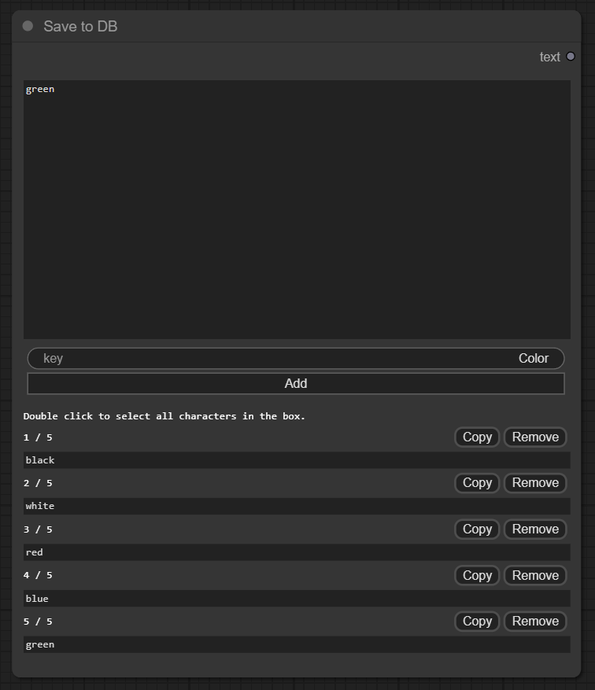
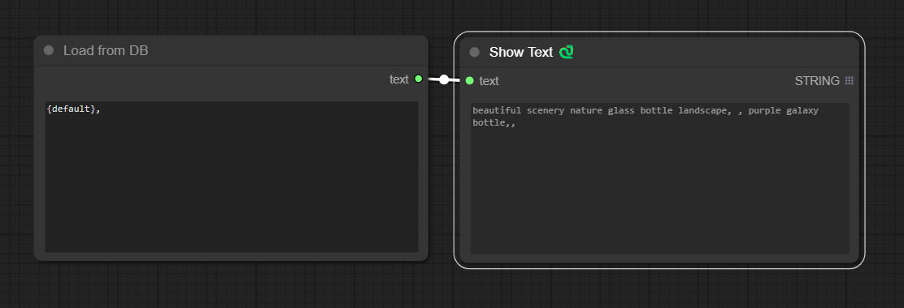
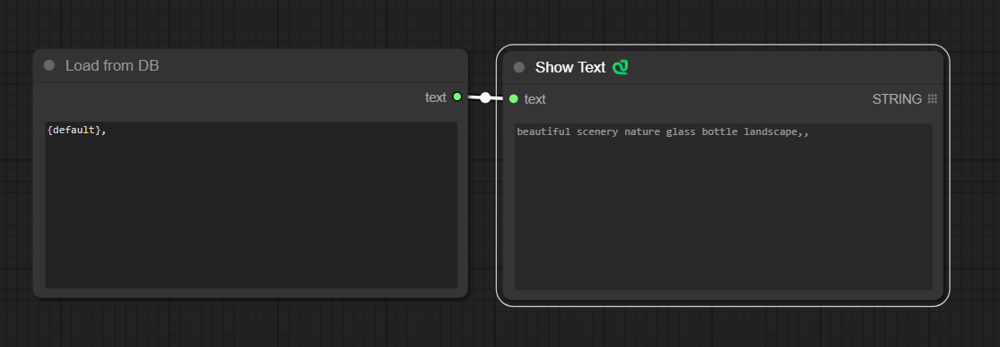

## comfyui-local-db

Store text to Key-Values pair json. 

## Usage

### Add node > utils > Save to DB

### Add node > utils > Load from DB

Add multiple values to string key. parsed only in braces.

e.g. {key} => choose random value in multiple values

## References

### [ComfyUI-Custom-Scripts](https://github.com/pythongosssss/ComfyUI-Custom-Scripts)