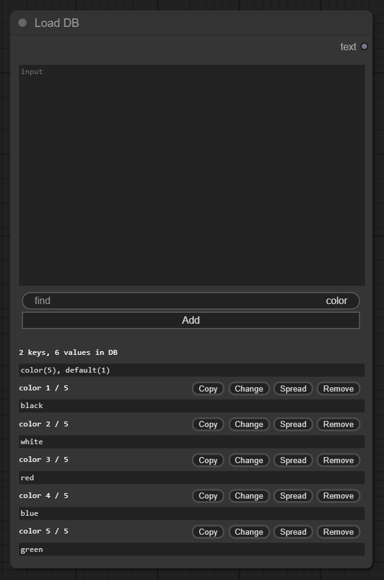
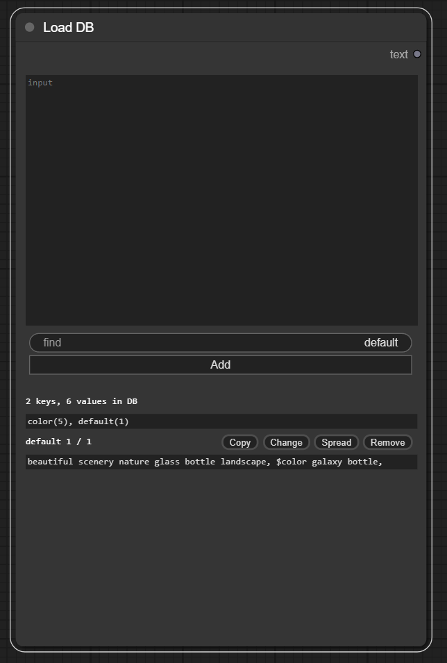
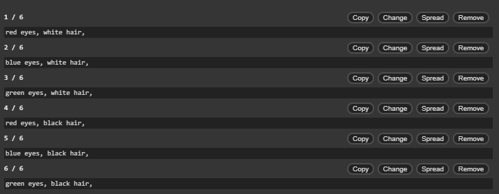

# comfyui-local-db

Store text to Key-Value pair database. 

## Usage

### Add node > utils > Load DB

Show values when enter key. In node textarea, **$ + key** will convert to random value in key.

  
  

### Spread

  
  <em>Before</em>

  
  <em>After</em>

## References

- [ComfyUI-Custom-Scripts](https://github.com/pythongosssss/ComfyUI-Custom-Scripts)