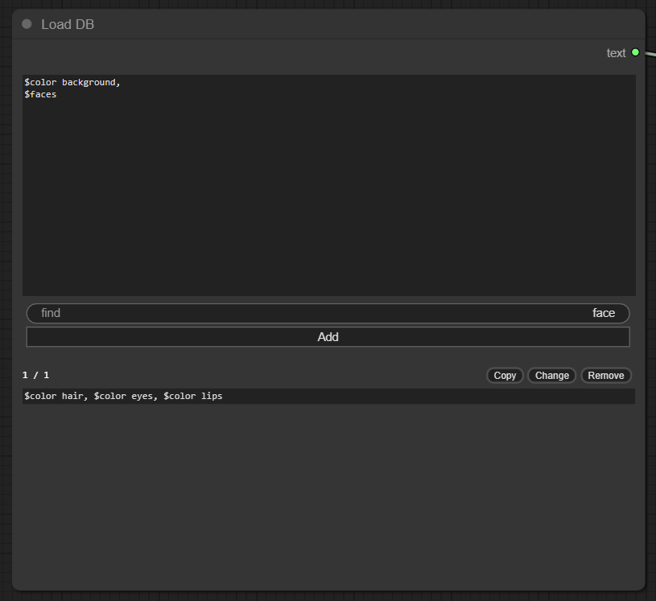
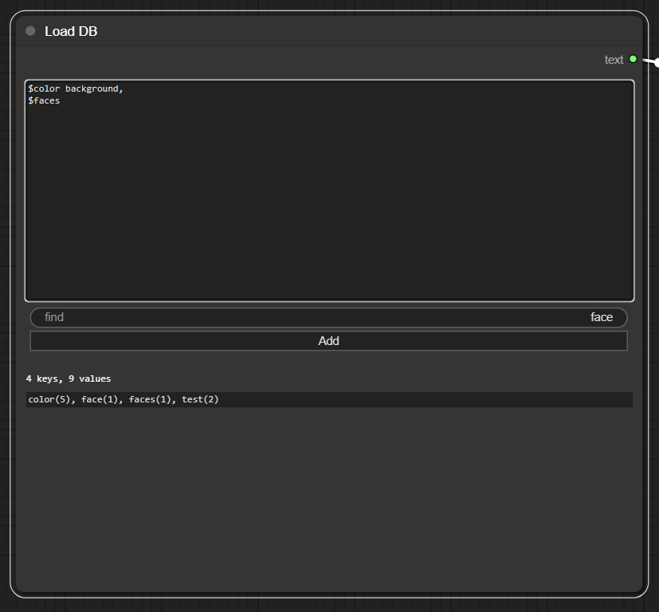

# comfyui-local-db

Store text to Key-Value pair database. 

## Usage

### Add node > utils > Load DB

Show values when enter key.

Show all keys in DB when focus on textarea.

Enter to textarea $ + key.

If multiple values in key, choose one randomly.

### Spread

before

after

## References

- [ComfyUI-Custom-Scripts](https://github.com/pythongosssss/ComfyUI-Custom-Scripts)